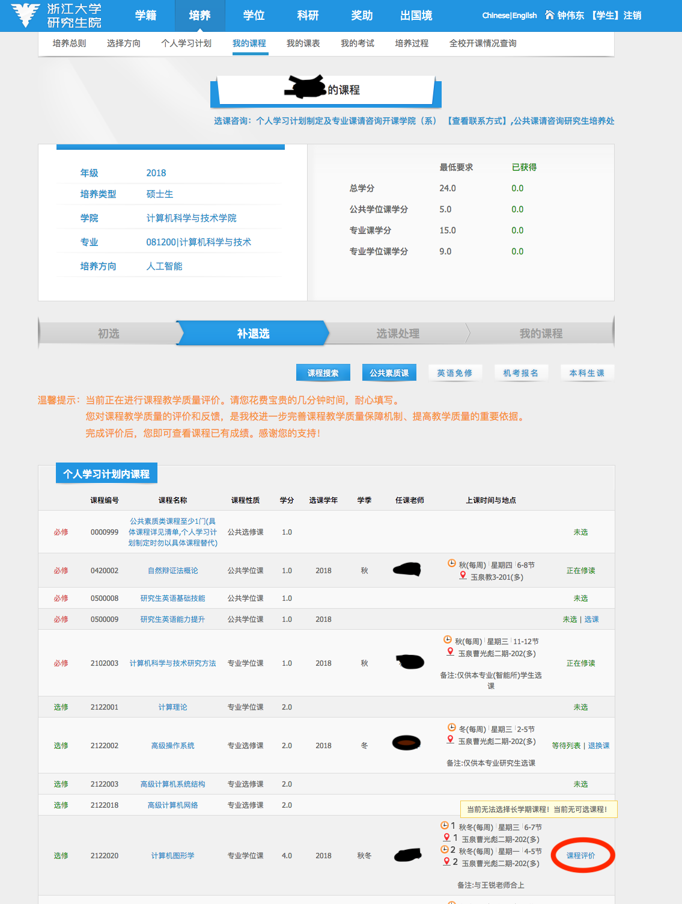
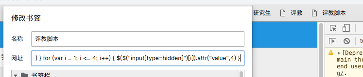

#一键评教脚本

## 介绍

貌似本科生不是用这个平台所以不能用

灵感来自[rccoder](https://github.com/rccoder)

由于代码太简单了，实际上也不需要专门的代码文件，所以这个库就是有这个说明文档就够了

这图是教务处课程页面



评教页面如下：


## 代码

代码很粗暴且全给最高分，觉得不合适可以自行修改

JavaScript：

```javascript
for (var i = 0; i <= 79; i++) { 
    $(".styled")[i].click() 
} 
for (var i = 1; i <= 4; i++) { 
    $($("input[type=hidden]")[i]).attr("value",4)
}
```

这个代码实际上不会去点旁边那个星星，直接修改最后提交参数的那个隐藏的input（才不是我不会呢

## 使用方法

1. 使用方法1

   打开开发者工具里console

   运行如上脚本即可

2. 使用方法2**（推荐）**:

   在Chrome浏览器中，右键书签栏，点击添加网页

   名称随便起，网址输入如下内容

   ```
   javascript:for (var i = 0; i <= 79; i++) { $(".styled")[i].click() } for (var i = 1; i <= 4; i++) { $($("input[type=hidden]")[i]).attr("value",4) }
   ```

   然后在评教页面点击一下这个书签即可

最后就是这样的一个书签

